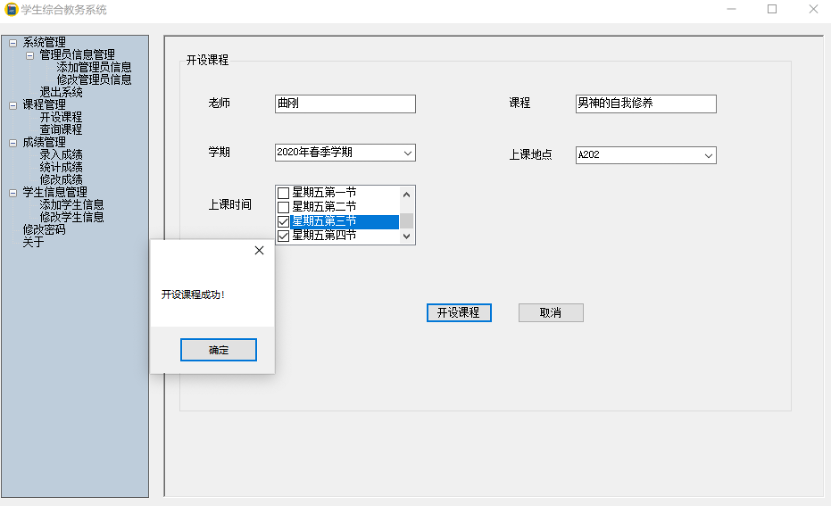

# Management Information System for Student Course Selection and Grade Inquiry

## Functional Flow of System Implementation

## Database Design

### Schema

## Program Structure

### Diagram of Program Structure

## User Interface

